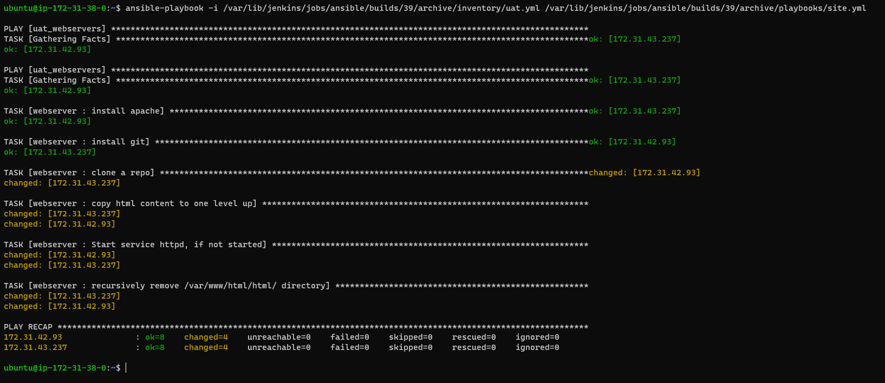

## **ANSIBLE REFACTORING**

In the initial project we wrote all our task in one playbook called common.yml. Imagine if we had many tasks, servers and we need to apply our playbook to other srvers with different requirements. Reading through the playbook will be challenging not just for you but for others too.

To fix this mess we will break our task down to diffrent files to reduce complexity. This is known s refactoring. 

**A--Jenkins job enhancement**
We will make some changes to our Jenkins jobs. First we will add a plugin called Copy Artifact.

1. Go to your Jenkins-Ansible server and create a new directory called ansible-config-artifact – we will store there all artifacts after each build.

  `sudo mkdir /home/ubuntu/ansible-config-artifact`

2. Change permissions to this directory, so Jenkins could save files there – chmod -R 0777 /home/ubuntu/ansible-config-artifact

3. Go to Jenkins web console -> Manage Jenkins -> Manage Plugins -> on Available tab search for Copy Artifact and install this plugin without restarting Jenkins

4. The main idea of save_artifacts project is to save artifacts into /home/ubuntu/ansible-config-artifact directory. To achieve this, create a Build step and choose Copy artifacts from other project, specify ansible as a source project and /home/ubuntu/ansible-config-artifact as a target directory.


5. After this changes we can test our build by updating the README.md file which is inside ansible-config mgt repository. If both jobs have completed one after another we will see the files inside /home/ubuntu/ansible-config-artifact

**B--REFACTOR ANSIBLE CODE**

Before starting to refactor the codes, ensure that you have pulled down the latest code from master (main) branch, and created a new branch, name it refactor.

1. Within playbooks folder, create a new file and name it site.yml – This file will now be considered as an entry point into the entire infrastructure configuration. Other playbooks will be included here as a reference.

2. Create a new folder in root of the repository and name it static-assignments. The static-assignments folder is where all other children playbooks will be stored. This is merely for easy organization of our work.

3. Move common.yml file which is inside the playbook folder into the newly created static-assignments folder.

4. Inside site.yml file, import common.yml playbook.

``````
---
- hosts: all
- import_playbook: ../static-assignments/common.yml
``````

The code above uses built in import_playbook Ansible module. Our folder structure should look like this;

``````
├── static-assignments
│   └── common.yml
├── inventory
    └── dev
    └── stage
    └── uat
    └── prod
└── playbooks
    └── site.yml
``````

5. Run ansible-playbook command against the dev environment. We need to apply some task to our dev servers and wireshark is already installed. We will create another playbook under static-assignment and name it common-del.yml Here we will configure deletion of wireshark.

``````
---
- name: update web, nfs and db servers
  hosts: webservers, nfs, db
  remote_user: ec2-user
  become: yes
  become_user: root
  tasks:
  - name: delete wireshark
    yum:
      name: wireshark
      state: removed

- name: update LB server
  hosts: lb
  remote_user: ubuntu
  become: yes
  become_user: root
  tasks:
  - name: delete wireshark
    apt:
      name: wireshark-qt
      state: absent
      autoremove: yes
      purge: yes
      autoclean: yes
``````

6. Let's update site.yml with - import_playbook: ../static-assignments/common-del.yml instead of common.yml and run it against dev servers

``````
cd /home/ubuntu/ansible-config-artifact/

ansible-playbook -i inventory/dev.yml playbooks/site.yaml
``````
 
7. Make sure that wireshark is deleted on all the servers by running wireshark --version

**C-- CONFIGURE UAT WEBSERVER WITH A ROLE 'WEBSERVER**

Next we want to configure two new webservers in uat folder. e could write tasks to configure Web Servers in the same playbook, but it would be too messy, instead, we will use a dedicated role to make our configuration reusable.

1. We will launch two EC2 instances using RHEL8 image, we will use them as our UAT server.

2. To create a role, you must create a directory called roles/, relative to the playbook file.

3. We will create the folder structure and files manually. The entire file structure should look like below. All inside roles folder.

``````
└── webserver
    ├── README.md
    ├── defaults
    │   └── main.yml
    ├── handlers
    │   └── main.yml
    ├── meta
    │   └── main.yml
    ├── tasks
    │   └── main.yml
    └── templates
``````
4. we will Update our inventory ansible-config-mgt/inventory/uat.yml file with IP addresses of our 2 UAT Web servers

``````
[uat-webservers]
<Web1-UAT-Server-Private-IP-Address> ansible_ssh_user='ec2-user' 

<Web2-UAT-Server-Private-IP-Address> ansible_ssh_user='ec2-user' 
``````

5. In /etc/ansible/ansible.cfg file let us uncomment roles_path string and provide a full path to our roles directory roles_path    = /home/ubuntu/ansible-config-artifact/roles, so Ansible could know where to find configured roles.

6. In our webser role, in tasks folder, we will update the main.yml file as below.

``````
---
- name: install apache
  become: true
  ansible.builtin.yum:
    name: "httpd"
    state: present

- name: install git
  become: true
  ansible.builtin.yum:
    name: "git"
    state: present

- name: clone a repo
  become: true
  ansible.builtin.git:
    repo: https://github.com/<your-name>/tooling.git
    dest: /var/www/html
    force: yes

- name: copy html content to one level up
  become: true
  command: cp -r /var/www/html/html/ /var/www/

- name: Start service httpd, if not started
  become: true
  ansible.builtin.service:
    name: httpd
    state: started

- name: recursively remove /var/www/html/html/ directory
  become: true
  ansible.builtin.file:
    path: /var/www/html/html
    state: absent
``````

7. The code above will 
- Install and configure Apache (httpd service)
- Clone Tooling website from GitHub https://github.com/darey-io/tooling.git
- Ensure the tooling website code is deployed to /var/www/html on each of 2 UAT Web servers.
- Make sure httpd service is started

**D-- REFERENCE 'WESERVER' ROLE**

1. Within the static-assignments folder, we will create a new assignment for uat-webservers uat-webservers.yml. This is where you will reference the role.

``````
---
- hosts: uat-webservers
  roles:
     - webserver
``````

2. The entry pint to our ansible configuration is the site.yml in playbook folder. Therefore we need to refer our uat-webserver.yml rolse inside site.yml as shown below.

``````
---
- hosts: all
- import_playbook: ../static-assignments/common.yml

- hosts: uat-webservers
- import_playbook: ../static-assignments/uat-webservers.yml
``````
**E-- COMMIT AND TEST**

Since we have been using a git branch called refator, we will commit our changes, create a pull request nd merge with the main branch. At the same time our webhook will trigger our jenkins jobs and update our artifacts in our server /home/ubuntu/ansible-config-artifact/.

1. Now let's run our playbook against our UAT inventory 

`sudo ansible-playbook -i /home/ubuntu/ansible-config-mgt/inventory/uat.yml /home/ubuntu/ansible-config-mgt/playbooks/site.yaml`

OR

`ansible-playbook -i /var/lib/jenkins/jobs/ansible/builds/39/archive/inventory/uat.yml /var/lib/jenkins/jobs/ansible/builds/39/archive/playbooks/site.yml`



2. We can now see both of your UAT Web servers configured and we will reach them on our web browser. 

http://ec2-16-171-6-172.eu-north-1.compute.amazonaws.com/index.php

or

http://ec2-16-171-162-222.eu-north-1.compute.amazonaws.com/index.php


3. Our Ansible architecture will now look like below.


END
